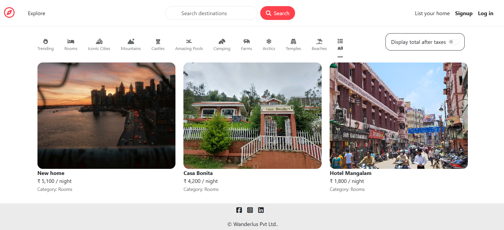
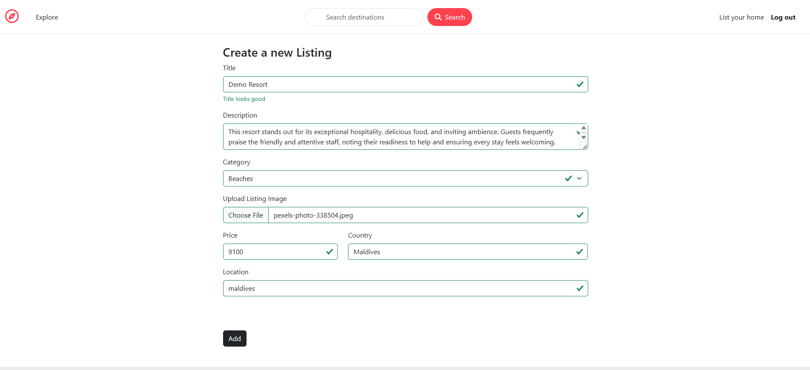
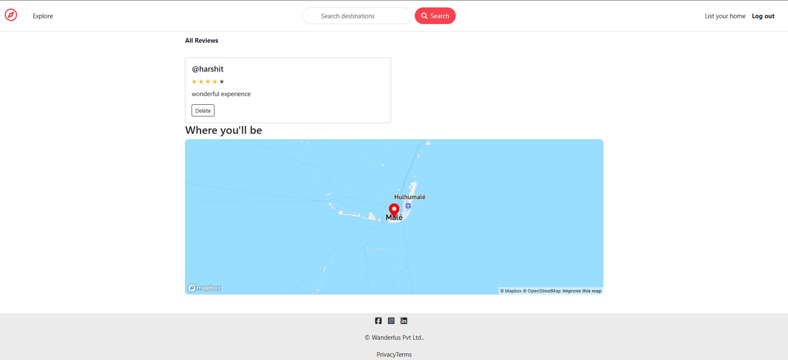
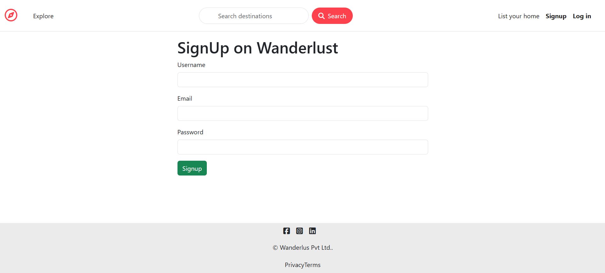

# 🌍 Wanderlust – Hotel Listing Platform

Wanderlust is a full-featured travel listing platform inspired by Airbnb, built using the MERN stack with EJS templating.
It allows users to explore, create, and manage property listings, authenticate securely, and interact through an intuitive UI and smooth routing.

## 🚀 Features

🔐 User Authentication (Signup, Login, Logout with Passport.js)

📝 CRUD Operations – Add, Edit, Delete, and View Listings

📍 Map Integration (future scope for geolocation support)

🌐 RESTful Routes with clean and scalable codebase

⚠️ Flash Messages for errors & feedback

🖥️ Responsive UI with Bootstrap

☁️ Deployment-ready (Hosted on Render)

## 🛠️ Tech Stack

Frontend: HTML, CSS, Bootstrap, EJS

Backend: Node.js, Express.js

Database: MongoDB (via Mongoose)

Authentication: Passport.js (Local Strategy)

Templating: EJS

Others: connect-flash, express-session

## 📂 Project Structure
```
Wanderlust/
│-- controllers/      # Controller logic for routes
│-- init/             # Initialization files (DB, seed scripts, etc.)
│-- models/           # Mongoose models (Listings, Users)
│-- public/           # Static files (CSS, JS, Images)
│-- routes/           # Express route handlers
│-- utils/            # Utility functions/helpers
│-- views/            # EJS templates (UI pages)

│-- app.js            # Main server entry point
│-- cloudConfig.js    # Cloudinary or cloud service configuration
│-- middleware.js     # Custom middleware (auth checks, validation)
│-- schema.js         # Joi validation schemas
│-- package.json      # Dependencies & scripts
│-- README.md         # Documentation
│-- .gitignore        # Ignored files (node_modules, .env etc.)

```
## ⚡ Installation & Setup
1. **Clone the repository:**
```
git clone https://github.com/HarshitVatsa-7/Wanderlust.git
cd Wanderlust
```
2. **Install dependencies:**
```
npm install
```
3. **Create a .env file in the root and add your variables:**
```
MONGO_URI=your_mongodb_connection_string
SESSION_SECRET=your_secret_key
CLOUD_NAME=your_cloudinary_name
CLOUD_API_KEY=your_cloudinary_api_key
CLOUD_API_SECRET=your_cloudinary_secret
```
4. **Run the server:**
```
npm start
```
5. **Visit in browser:**
```
http://localhost:3000
```
## 📸 Screenshots
### 🏡 Home Page  
  
### ✍️ Create Listing

### 🏨 Show Listing  


### 🔐 Login Page  
  
## 🔗 Links
👉https://wanderlust-0duo.onrender.com/
